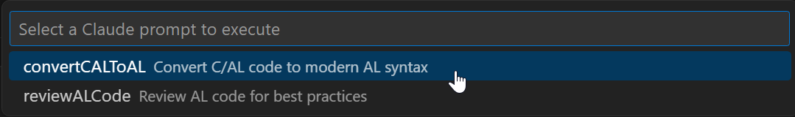

# BC/AL Upgrade Assistant

A Visual Studio Code extension to assist in transforming old C/AL code to modern AL syntax and provide AI-powered assistance for Microsoft Dynamics 365 Business Central development.

## Features

- Split C/AL objects from text files
- Convert C/AL code to AL syntax
- AI-powered code review and suggestions using Claude models
- Code formatting and documentation help



## Requirements

- Visual Studio Code 1.80.0 or higher
- Claude API key for AI-powered features

## Extension Settings

This extension contributes the following settings:

- `bc-al-upgradeassistant.claude.apiKey`: API Key for accessing Claude API
- `bc-al-upgradeassistant.claude.model`: Claude model to use for API requests
- `bc-al-upgradeassistant.claude.defaultSystemPrompt`: Default system prompt to use with Claude API
- `bc-al-upgradeassistant.claude.prompts`: Collection of prompts for Claude API

## Commands

- `BC AL Upgrade Assistant: Refresh Symbol Cache`: Refreshes the symbol cache
- `BC AL Upgrade Assistant: Split C/AL Objects from File`: Splits C/AL objects from a text file
- `BC AL Upgrade Assistant: Run Claude AI Prompt`: Select and run a Claude AI prompt
- `BC AL Upgrade Assistant: Set Default Model to Claude `: Changes the default model

## Getting Started

1. Install the extension
2. Set your Claude API key in the extension settings
3. Open a C/AL or AL file
4. Use the commands from the command palette (Ctrl+Shift+P)

### Configuring Custom Prompts

You can customize the AI prompts through the settings:

```json
"bc-al-upgradeassistant.claude.prompts": [
  {
    "commandName": "convertCALToAL",
    "commandDescription": "Convert C/AL code to modern AL syntax",
    "systemPrompt": "You are an expert AL and C/AL programming assistant. You help developers convert legacy C/AL code to modern AL code for Business Central.",
    "userPrompt": "Please convert the following C/AL code to AL:\n\n{{code}}",
    "example": "OnOpenPage()\nBEGIN\n  CurrForm.UPDATE;\nEND;"
  },
  {
    "commandName": "reviewALCode",
    "commandDescription": "Review AL code for best practices",
    "systemPrompt": "You are an AL code reviewer specializing in Business Central best practices.",
    "userPrompt": "Review the following AL code and suggest improvements for performance and readability:\n\n{{code}}",
    "example": ""
  },
  {
    "commandName": "explainComplexLogic",
    "commandDescription": "Explain complex logic using Opus model",
    "model": "claude-3-opus-20240229",
    "systemPrompt": "You are an expert AL code explainer for Microsoft Dynamics 365 Business Central.",
    "userPrompt": "Explain in detail how the following complex algorithm works:\n\n{{code}}",
    "example": ""
  },
  {
    "commandName": "quickFormat",
    "commandDescription": "Quick code formatting using Haiku model",
    "model": "claude-3-haiku-20240307",
    "systemPrompt": "You are a code formatter that improves readability without changing functionality.",
    "userPrompt": "Format and improve the indentation of this code without changing its functionality:\n\n{{code}}",
    "example": ""
  },
  {
    "commandName": "explainComplexAI",
    "commandDescription": "Use Claude 3.7 to explain complex AI concepts",
    "model": "claude-3-7-sonnet-20250219",
    "systemPrompt": "You are an AI expert with deep understanding of complex algorithms. Explain concepts clearly.",
    "userPrompt": "Explain the following algorithm as if explaining to another developer:\n\n{{code}}"
  }
]
```

Each prompt has the following properties:

- `commandName`: A unique identifier for the prompt (no spaces)
- `commandDescription`: A brief description of what the command does (shown in the selection dialog)
- `model`: (Optional) Specific Claude model to use for this prompt (dropdown selection in settings UI)
- `systemPrompt`: Instructions for the AI about its role (optional, falls back to default)
- `userPrompt`: The actual prompt template. Use `{{code}}` where you want the selected code to be inserted
- `example`: An optional example (not shown in the dialog but helps users understand the prompt)

**Note:** The extension will validate model names and fall back to your default model if an invalid model is specified.

**Note:** After modifying prompts in settings, you'll need to reload the window for changes to take effect.
