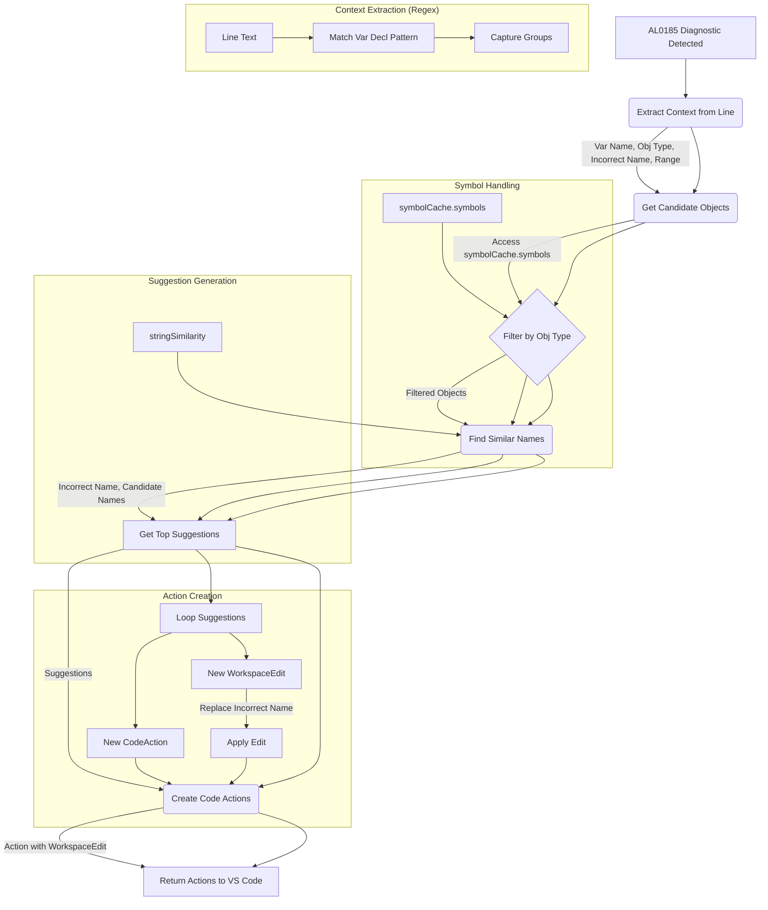

# Plan: Create Object Suggestion Action Provider

This plan outlines the steps to create a VS Code Code Action Provider that suggests corrections for AL object names based on compiler error AL0185.

## 1. Create New File

- Create a new file: `src/providers/objectSuggestionProvider.js`.

## 2. Define Class

- Inside the new file, define a class `ObjectSuggestionActionProvider` that implements `vscode.CodeActionProvider`.

## 3. Implement `provideCodeActions` Method

This method will receive `document`, `range`, and `context`.

- **Filter Diagnostics:** Check `context.diagnostics` for errors with the code `AL0185`.
- **Iterate AL0185 Errors:** For each relevant diagnostic:
  - **Extract Context:**
    - Get the text of the line containing the error.
    - Use a regular expression (e.g., `^\s*(\w+)\s*:\s*(\w+)\s+(?:(["'])([^"']+)["']|([^\s";]+))\s*;`) to parse the variable declaration, capturing:
      - Variable Name
      - Object Type
      - Incorrect Object Name (quoted or unquoted)
      - Range of the incorrect name.
  - **Get Target Object Type:** Use the captured Object Type. Normalize if necessary (e.g., case-insensitive, map "Record" to "Table").
  - **Access Symbol Cache:** Import `symbolCache` from `../symbolCache`.
  - **Get Candidate Objects:**
    - Retrieve all cached symbols: `const allSymbols = Object.values(symbolCache.symbols);`
    - Filter `allSymbols` to keep only those where `symbol.Type` matches the `targetObjectType` (case-insensitive).
  - **Find Similar Names:**
    - Import `stringSimilarity` from `../utils/stringSimilarity`.
    - Use `stringSimilarity.findSimilarNames` (or similar) to compare the incorrect name against the `Name` property of candidates. Limit suggestions.
  - **Create Code Actions:** For each suggestion:
    - Create a `vscode.CodeAction` (e.g., `Change to '${suggestion.Name}'`) of kind `QuickFix`.
    - Associate with the diagnostic.
    - Create a `vscode.WorkspaceEdit` to replace the incorrect name range with the correctly formatted suggestion (handle quotes).
    - Assign the edit to the action.
    - Optionally mark the best match as preferred.
    - Add the action to the results array.
- **Return Actions:** Return the array of created code actions.

## 4. Register Provider

- In `src/extension.js` (or relevant registration module):
- Import the new `ObjectSuggestionActionProvider`.
- Register it for the 'al' language using `vscode.languages.registerCodeActionsProvider`.

## 5. Dependencies

- Ensure `vscode`, `../symbolCache`, and `../utils/stringSimilarity` are imported in `objectSuggestionProvider.js`.

## Process Flow Diagram

## Note on Object Type Coverage

This plan relies on the `symbolCache` containing entries for the required object types (Table, Page, Report confirmed). If suggestions are needed for other types like Codeunit, Query, Xmlport, etc., the `symbolCacheWorker.js` might need to be updated to extract and cache these object types.
